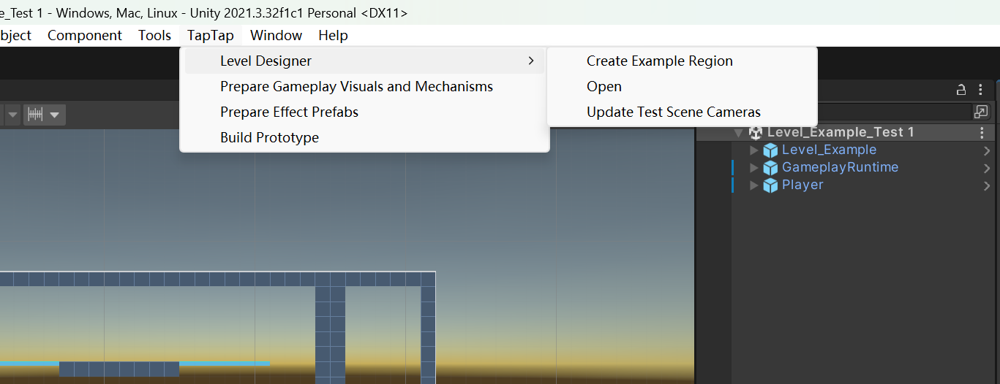
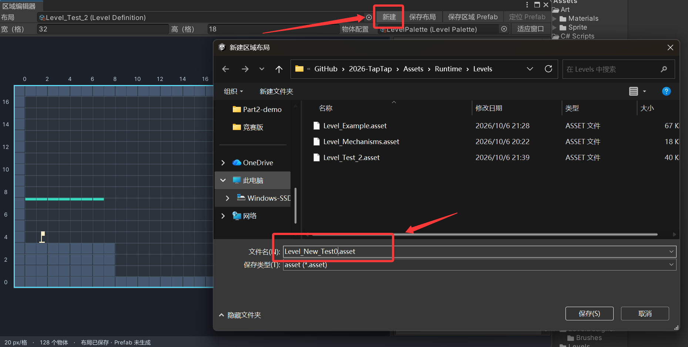
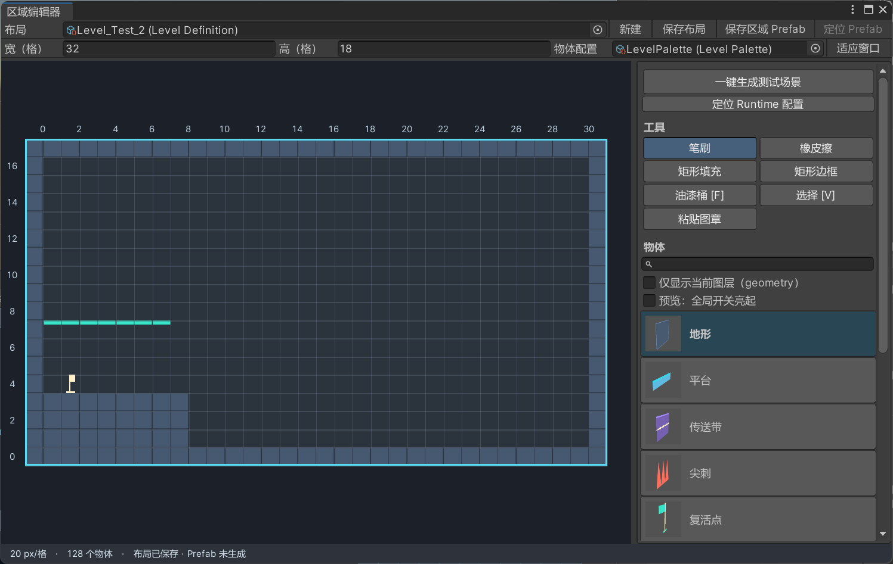
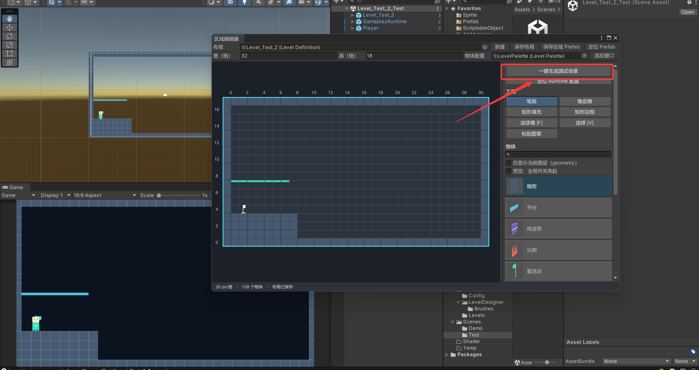
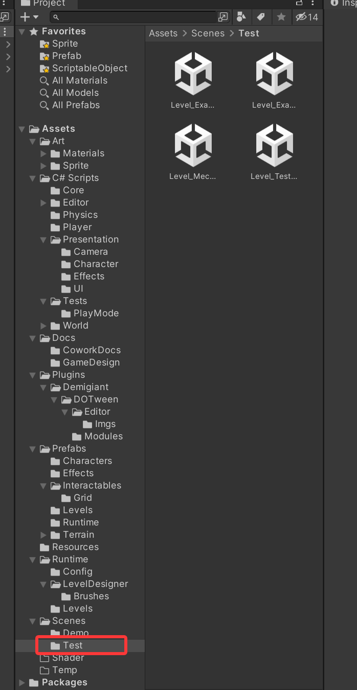

# 关卡编辑器

此编辑器用于快速搭建谜题验证功能，暂时不用于美术资源配置等工作（

快速探索一些谜题组合的难度和心流曲线，以及预览它们的地形结构，方便后续挑选放进大地图组合。

### 怎么用？

1. 在上方下拉菜单打开TapTap-LevelDesigner-Open打开菜单

2. 新建一个关卡配置，文件的保存位置预设好了，只需要给它命名即可

3. 在编辑器中直接设计关卡，左键涂鸦，右键橡皮，中键取色，其它功能和像素绘画软件差不多。

4. 选择一键生成测试场景，会自动将需要配置的其它内容完成并创建该场景，Play即可直接测试效果

5. 保存的关卡预览位置

### 测试批注与体验评价

使用“测试批注 [N]”笔刷放置批注，在关卡编辑器中将鼠标放到批注上按 N 编辑原文。批注原始内容保存在 `Assets/Runtime/Levels/*.asset` 中的 `Placements → AnnotationPlacementSettings.Text`；测试场景里的批注只是它的展示实例。

在 Unity 编辑器的 Play 模式测试场景时，角色身体或头部靠近红色批注标记，会出现批注内容和空格提示。按空格打开 UGUI 评价窗口，可以填写体验感受、改进想法和整体设计评价。多个批注范围重叠时打开距离角色最近的一个。

窗口打开期间暂停游戏，输入文字不会触发移动、头身分离或 R 键重置。输入停顿半秒或输入框失去焦点后自动保存，点击“保存并继续体验”、按 Esc 或退出 Play 模式时也会保存。评价带时间追加到原始批注末尾，保留原文和此前的评价；同一次窗口内继续修改会更新当前记录。退出 Play 模式后可在关卡编辑器按 N 查看和编辑这些评价。

新生成的测试场景通过批注 ID 定位原始内容；旧测试场景自动通过所属关卡和批注的格子位置定位。若窗口提示找不到原始批注，请重新生成测试场景。回写功能用于 Unity 编辑器的 Play 模式，发布后的游戏不写入工程资源。
